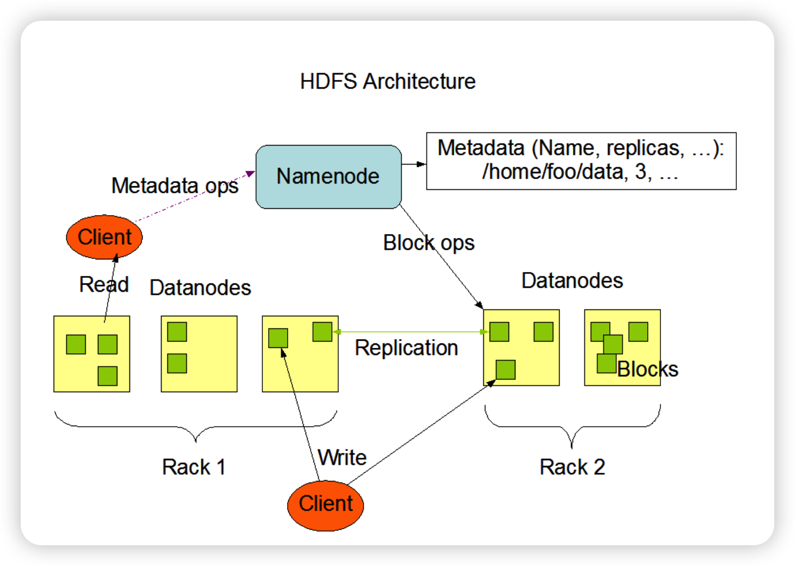
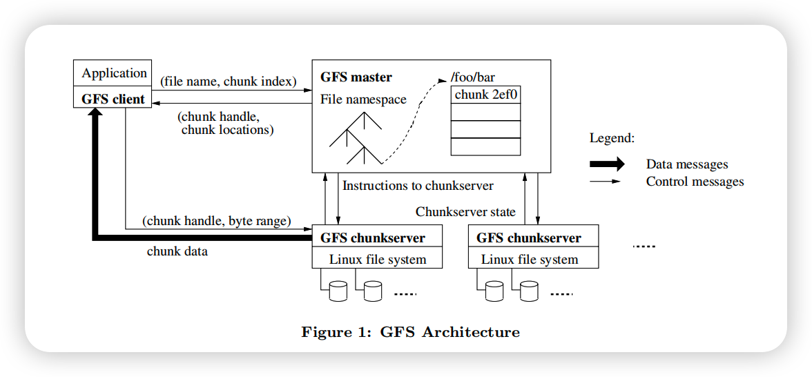

# 一、历史

HDFS参考GFS架构设计了第一代分布式文件系统。

# 二、应用场景

HDFS和GFS上的应用与一般的应用不同，HDFS被设计成适合批量处理，而不是用户交互式的。数据对象的大小一般为64M，相较于数据访问的反应时间，更注重数据访问的高吞吐量。采用流式的数据访问方式: 即 **一次写入、多次读取** ，数据集经常从数据源生成或者拷贝一次，然后在其上做很多分析工作 ，且不支持文件的随机修改。

# 三、架构对比

1、GFS和HDFS的架构设计上非常相似，通过中心化的元数据服务器提供文件系统元数据服务。

GFS叫master节点，HDFS叫nameserver。

数据服务则由数据节点提供，GFS叫chunkserver，HDFS叫DataNode

所以HDFS和GFS都有一样的设计缺陷，元数据服务器宕机集群不可用。因此在后续优化里，元数据服务器可能用主备的方式或者别的方式，其次元数据服务器频繁查询成为整个系统的瓶颈。

Ceph第一次提出了去中心化的设计，通过crush算数据分布。并且其元数据服务通过分布式共识维护，能够保证一定的可靠性。

# 四 一致性对比

GFS和HDFS一致性都比较差，实现的都是最终一致性，客户端可能读到过期的副本和元数据。
并发追加写可能导致数据冲突。

CEPH实现的是强一致，也就是线性一致性，通过类似2PC的机制保证集群间的原子性，和本地WAL的处理，保证节点内的一致性。
