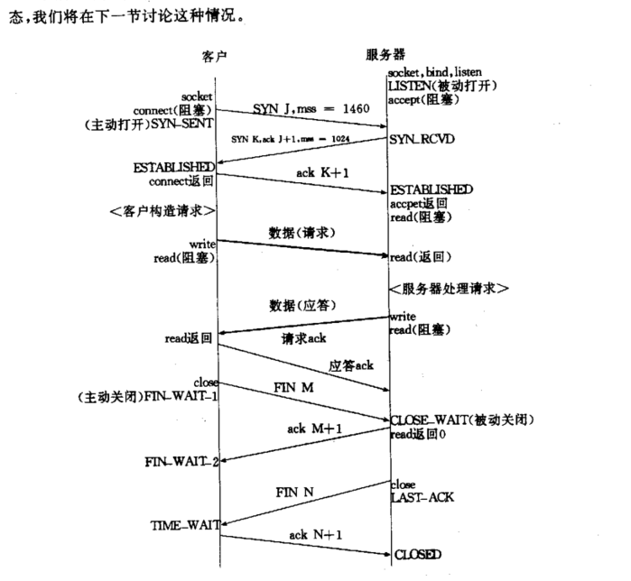
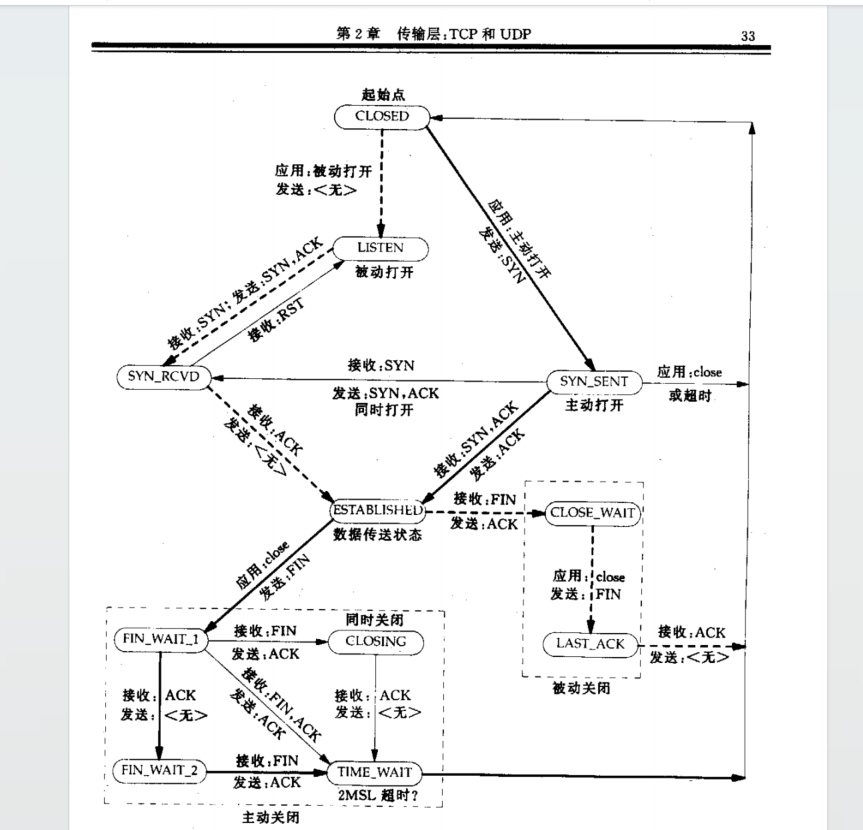
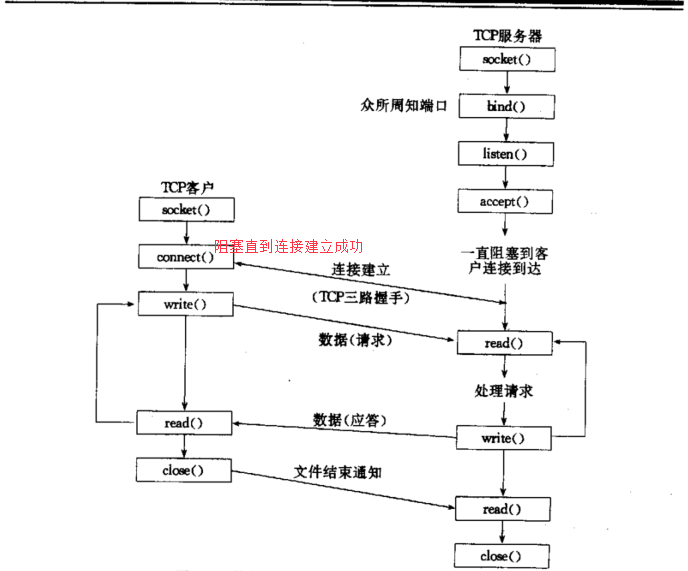
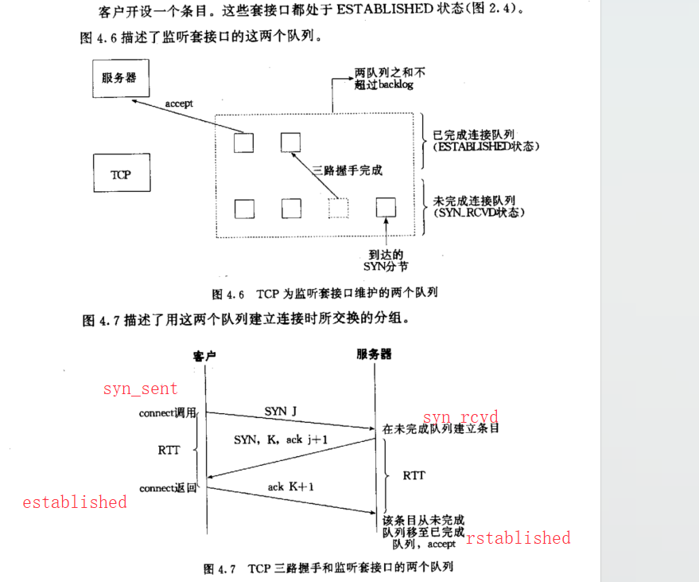

# C++

## 虚函数

## 智能指针实现

## c11新语法

# 分布式存储

## leveldb

## daos

## GFS

## ceph

## WAS

## 各种存储的类比

# 共识算法

## paxos

## multi-paxos

## raft

# 算法

# 存储介质特性

## HDD特性

## SATA SSD

## NVME SSD

# 块存储协议类型和基本原理

## ISCSI

## NVMF

# 计算机网络

## 三次握手四次挥手

状态变更图：

## 网络编程函数

### connect

    1、connect函数的阻塞行为取决于你使用的套接字是否设置为非阻塞模式。在默认的阻塞模式下，connect函数会阻塞直到三次握手完成或者出现错误（如超时）。这意味着如果你在一个应用中调用了connect函数，那么该应用会停止执行，直到connect函数返回。然而，你也可以设置套接字为非阻塞模式。在非阻塞模式下，connect函数会立即返回。你可以使用select、poll或者epoll等函数来检查连接是否已经建立。如果connect函数返回EINPROGRESS错误，这意味着连接正在进行中，你需要稍后再检查连接状态。总的来说，connect函数默认是阻塞的，但你可以通过设置套接字为非阻塞模式来改变这种行为。

2、如果收到RST报文、表示服务端没有进程监听目标端口，客户端返回ECONNECTREFUSTED

### bind

    获取绑定的 IP 地址和端口号：你可以使用 getsockname 函数来获取套接字绑定的 IP 地址和端口号。这个函数会将套接字的地址信息填充到一个 sockaddr 结构体中，你可以从这个结构体中读取 IP 地址和端口号。请注意，IP 地址和端口号都会以网络字节序的形式返回，你可能需要使用 ntohs 和 inet_ntoa 等函数将它们转换为可读的形式。

### accept

    accept 函数在网络编程中用于接受一个连接请求，它并不直接控制内核为套接字分配的缓冲区大小。accept 函数从监听套接字的等待连接队列中取出第一个连接请求，创建一个新的已连接套接字，并返回一个指向这个新套接字的文件描述符。

参数 backlog 与 accept 函数有关，但它不控制缓冲区的大小。backlog 参数指定了监听套接字的等待连接队列的最大长度。这个队列包括了那些已经完成三次握手但是还没有被应用程序通过 accept 调用接受的连接。如果队列已满，新的连接请求可能会被拒绝。

内核为每个套接字维护两个缓冲区：一个接收缓冲区和一个发送缓冲区。它们的大小通常由系统默认值决定，但可以通过套接字选项 SO_RCVBUF 和 SO_SNDBUF 使用 setsockopt 函数进行调整。

总结一下：

* backlog 控制的是传入连接请求队列的最大长度，而不是缓冲区的大小。
* 套接字缓冲区的大小是分别由 SO_RCVBUF 和 SO_SNDBUF 套接字选项控制的。
* accept 函数用于从监听队列中接受一个连接请求，创建一个新的已连接套接字。
  

# 操作系统

## 内存

1. 内存模型
2. 内存页面管理
3. 缺页类型：major fault和minor fault：major fault是物理内存里也没有；minor fault是物理内存有这个地址，但是已经被操作系统归还了，不属于这个进程可使用范围，这个时候入锅这个虚拟机地址刚好被申请，那么就会重新分配物理内存，更新页表项(也就是虚拟机内存到物理内存的映射关系)
   参考：https://www.cnblogs.com/binlovetech/p/17918733.html
4. 大页

# 计算机组成原理

# 一些基础组件实现

## 线程池

## 内存池

## 设计模式

# 性能
